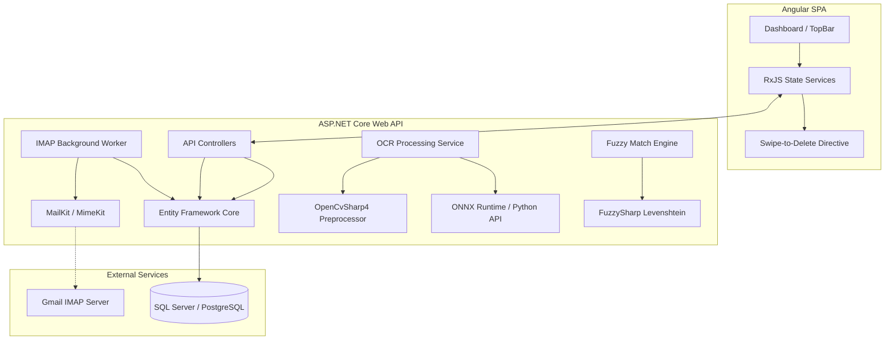
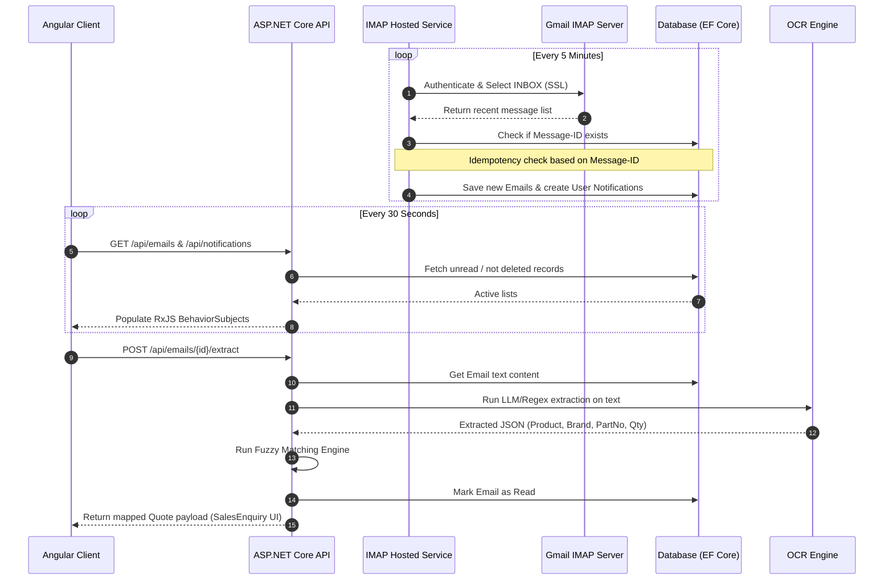

# Migration & Design Specification: Angular & .NET Product Extraction System

This document provides a comprehensive, production-ready technical blueprint to migrate the **Handwritten Product Extraction & Email Automation System** from the Python/React prototype to an **Angular** frontend and **.NET Core** backend.

---

## 1. System Architecture Blueprint

The system consists of a single-page Angular application communicating with an ASP.NET Core Web API. A SQL database (SQL Server or PostgreSQL) stores local entities. A .NET Background Service handles periodic IMAP synchronization. 

The OCR pipeline operates in two modes:
1. **Option A (Recommended for Performance & Simplicity):** The .NET backend delegates image classification and text generation to a lightweight Python FastAPI microservice running the HuggingFace TrOCR PyTorch model (native GPU acceleration).
2. **Option B (Pure .NET):** The .NET backend uses the `Microsoft.ML.OnnxRuntime` package to run a quantized TrOCR model directly in-process.

### High-Level Components



### System Sequence Flow

The diagram below outlines the flow of email syncing, background notifications, and OCR extraction.



---

## 2. Database Schema & EF Core Entity Design

To support email tracking, notifications, product lookup, and quotation drafting, implement the following schema using Entity Framework Core.

### Entity Definitions (C#)

```csharp
using System;
using System.ComponentModel.DataAnnotations;
using System.ComponentModel.DataAnnotations.Schema;

namespace ProductExtraction.Core.Entities
{
    [Table("Emails")]
    public class EmailEntity
    {
        [Key]
        [DatabaseGenerated(DatabaseGeneratedOption.Identity)]
        public int Id { get; set; }

        [Required]
        [StringLength(255)]
        public string MessageId { get; set; } = string.Empty;

        [Required]
        [StringLength(255)]
        public string Sender { get; set; } = string.Empty;

        [Required]
        [StringLength(255)]
        public string Recipient { get; set; } = string.Empty;

        [Required]
        [StringLength(500)]
        public string Subject { get; set; } = string.Empty;

        [Required]
        public string Body { get; set; } = string.Empty;

        [Required]
        public DateTime ReceivedAt { get; set; }

        [Required]
        public bool IsRead { get; set; } = false;

        [Required]
        public bool IsDeleted { get; set; } = false;
    }

    [Table("Notifications")]
    public class NotificationEntity
    {
        [Key]
        [DatabaseGenerated(DatabaseGeneratedOption.Identity)]
        public int Id { get; set; }

        [Required]
        [StringLength(500)]
        public string Text { get; set; } = string.Empty;

        [Required]
        public DateTime CreatedAt { get; set; } = DateTime.UtcNow;

        [Required]
        public bool IsRead { get; set; } = false;

        [Required]
        [StringLength(50)]
        public string Type { get; set; } = "info"; // "assigned", "ocr_complete", "report", "info"
    }

    [Table("Products")]
    public class ProductEntity
    {
        [Key]
        public int Id { get; set; }

        [Required]
        [StringLength(100)]
        public string Brand { get; set; } = string.Empty;

        [Required]
        [StringLength(100)]
        public string ProductCode { get; set; } = string.Empty;

        [Required]
        [StringLength(255)]
        public string ProductName { get; set; } = string.Empty;

        [Required]
        [Column(TypeName = "decimal(18, 2)")]
        public decimal UnitPrice { get; set; }

        [Required]
        public bool IsActive { get; set; } = true;
    }
}
```

### Database Context

```csharp
using Microsoft.EntityFrameworkCore;
using ProductExtraction.Core.Entities;

namespace ProductExtraction.Infrastructure.Data
{
    public class AppDbContext : DbContext
    {
        public AppDbContext(DbContextOptions<AppDbContext> options) : base(options) { }

        public DbSet<EmailEntity> Emails => Set<EmailEntity>();
        public DbSet<NotificationEntity> Notifications => Set<NotificationEntity>();
        public DbSet<ProductEntity> Products => Set<ProductEntity>();

        protected override void OnModelCreating(ModelBuilder modelBuilder)
        {
            base.OnModelCreating(modelBuilder);

            // Indexes
            modelBuilder.Entity<EmailEntity>()
                .HasIndex(e => e.MessageId)
                .IsUnique();

            modelBuilder.Entity<EmailEntity>()
                .HasIndex(e => e.IsDeleted);

            modelBuilder.Entity<NotificationEntity>()
                .HasIndex(n => n.IsRead);

            modelBuilder.Entity<ProductEntity>()
                .HasIndex(p => p.ProductCode);
        }
    }
}
```

---

## 3. Email Automation Subsystem

To connect securely to Gmail IMAP, parse multipart text bodies, download files, and track states, use the **MailKit** and **MimeKit** NuGet packages.

### Background Service Configuration (IMAP Sync)

Create a hosted background service (`EmailSyncWorker`) that triggers synchronization at regular intervals.

```csharp
using System;
using System.IO;
using System.Linq;
using System.Threading;
using System.Threading.Tasks;
using MailKit;
using MailKit.Net.Imap;
using MailKit.Search;
using MimeKit;
using Microsoft.Extensions.DependencyInjection;
using Microsoft.Extensions.Hosting;
using Microsoft.Extensions.Logging;
using Microsoft.Extensions.Options;
using ProductExtraction.Core.Entities;
using ProductExtraction.Infrastructure.Data;

namespace ProductExtraction.Infrastructure.Services
{
    public class EmailSettings
    {
        public string Host { get; set; } = "imap.gmail.com";
        public int Port { get; set; } = 993;
        public bool UseSsl { get; set; } = true;
        public string Username { get; set; } = string.Empty;
        public string Password { get; set; } = string.Empty; // Gmail App Password
        public int SyncIntervalSeconds { get; set; } = 300;
    }

    public class EmailSyncWorker : BackgroundService
    {
        private readonly IServiceProvider _serviceProvider;
        private readonly ILogger<EmailSyncWorker> _logger;
        private readonly EmailSettings _settings;

        public EmailSyncWorker(
            IServiceProvider serviceProvider,
            IOptions<EmailSettings> settings,
            ILogger<EmailSyncWorker> logger)
        {
            _serviceProvider = serviceProvider;
            _logger = logger;
            _settings = settings.Value;
        }

        protected override async Task ExecuteAsync(CancellationToken stoppingToken)
        {
            _logger.LogInformation("Background Email Synchronization loop started.");

            // Wait on startup
            await Task.Delay(5000, stoppingToken);

            while (!stoppingToken.IsCancellationRequested)
            {
                try
                {
                    _logger.LogInformation("Running scheduled Gmail IMAP synchronization...");
                    await SyncEmailsAsync(stoppingToken);
                }
                catch (Exception ex)
                {
                    _logger.LogError(ex, "Error in background email synchronization loop.");
                }

                await Task.Delay(TimeSpan.FromSeconds(_settings.SyncIntervalSeconds), stoppingToken);
            }
        }

        private async Task SyncEmailsAsync(CancellationToken cancellationToken)
        {
            if (string.IsNullOrEmpty(_settings.Username) || string.IsNullOrEmpty(_settings.Password))
            {
                _logger.LogWarning("Email credentials not configured. Skipping synchronization.");
                return;
            }

            using var client = new ImapClient();
            await client.ConnectAsync(_settings.Host, _settings.Port, _settings.UseSsl, cancellationToken);
            await client.AuthenticateAsync(_settings.Username, _settings.Password, cancellationToken);

            var inbox = client.Inbox;
            await inbox.OpenAsync(FolderAccess.ReadOnly, cancellationToken);

            // Fetch last 20 messages
            int count = inbox.Count;
            if (count == 0)
            {
                await client.DisconnectAsync(true, cancellationToken);
                return;
            }

            int startIdx = Math.Max(0, count - 20);
            var uids = await inbox.SearchAsync(SearchQuery.All, cancellationToken);
            var subsetUids = uids.Skip(startIdx).Take(20).ToList();

            using var scope = _serviceProvider.CreateScope();
            var db = scope.ServiceProvider.GetRequiredService<AppDbContext>();

            int newEmailsCount = 0;

            foreach (var uid in subsetUids)
            {
                var summary = await inbox.FetchAsync(new[] { uid }, MessageSummaryItems.Envelope | MessageSummaryItems.UniqueId, cancellationToken);
                var envelope = summary.FirstOrDefault()?.Envelope;
                if (envelope == null) continue;

                var messageId = envelope.MessageId?.Trim('<', '>', ' ', '\t') ?? $"fallback-{envelope.Date.Value.Ticks}";

                // Idempotency Check
                bool exists = db.Emails.Any(e => e.MessageId == messageId);
                if (exists) continue;

                // Load complete message details
                var message = await inbox.GetMessageAsync(uid, cancellationToken);
                
                string body = ExtractTextBody(message);
                var senderStr = envelope.From.ToString();
                var recipientStr = envelope.To.ToString();

                var emailEntity = new EmailEntity
                {
                    MessageId = messageId,
                    Sender = senderStr,
                    Recipient = recipientStr,
                    Subject = envelope.Subject ?? "(No Subject)",
                    Body = body,
                    ReceivedAt = envelope.Date?.DateTime ?? DateTime.UtcNow,
                    IsRead = false,
                    IsDeleted = false
                };

                db.Emails.Add(emailEntity);
                newEmailsCount++;

                // Trigger a local notification for new enquries
                if (envelope.Subject != null && envelope.Subject.Contains("enquiry", StringComparison.OrdinalIgnoreCase))
                {
                    db.Notifications.Add(new NotificationEntity
                    {
                        Text = $"New cold enquiry from {envelope.From.Mailboxes.FirstOrDefault()?.Name ?? "Customer"} assigned to you",
                        Type = "assigned",
                        CreatedAt = DateTime.UtcNow,
                        IsRead = false
                    });
                }
            }

            if (newEmailsCount > 0)
            {
                await db.SaveChangesAsync(cancellationToken);
                _logger.LogInformation("Synced {Count} new emails to database.", newEmailsCount);
            }
            else
            {
                _logger.LogInformation("Sync complete. No new emails found.");
            }

            await client.DisconnectAsync(true, cancellationToken);
        }

        private string ExtractTextBody(MimeMessage message)
        {
            if (!string.IsNullOrEmpty(message.TextBody))
            {
                return message.TextBody;
            }

            if (!string.IsNullOrEmpty(message.HtmlBody))
            {
                // Strip simple HTML tags using regex
                var rawText = System.Text.RegularExpressions.Regex.Replace(message.HtmlBody, "<[^>]+>", "");
                return System.Net.WebUtility.HtmlDecode(rawText).Trim();
            }

            return string.Empty;
        }
    }
}
```

---

## 4. OCR Preprocessing & TrOCR Engine

TrOCR models are highly sensitive to skew, ruled background notebook lines, and resolution constraints. Below is the C# translation of the OpenCV image preprocessing steps using **OpenCvSharp4** (a high-performance wrapper for OpenCV).

### OpenCV Preprocessor (`OcrPreprocessor.cs`)

Install the NuGet packages:
- `OpenCvSharp4`
- `OpenCvSharp4.runtime.win` (or Linux runtime package depending on target deploy environment)

```csharp
using System;
using System.Collections.Generic;
using System.Linq;
using OpenCvSharp;

namespace ProductExtraction.Infrastructure.OCR
{
    public class OcrPreprocessor
    {
        private const int MAX_DIMENSION = 2048;

        public List<Mat> PreprocessImage(string imagePath, out double elapsedMs)
        {
            var watch = System.Diagnostics.Stopwatch.StartNew();
            
            // Load source image
            using Mat src = Cv2.ImRead(imagePath, ImreadModes.Color);
            if (src.Empty())
                throw new ArgumentException($"Cannot read image: {imagePath}");

            // 1. Auto-crop paper margins
            using Mat cropped = AutoCrop(src);

            // 2. Scale image if too large
            using Mat resized = Resize(cropped);

            // 3. Grayscale
            using Mat gray = new Mat();
            Cv2.CvtColor(resized, gray, ColorConversionCodes.BGR2GRAY);

            // 4. Denoise (fastNlMeansDenoising)
            using Mat denoised = new Mat();
            Cv2.FastNlMeansDenoising(gray, denoised, 10, 7, 21);

            // 5. Enhance Contrast with CLAHE
            using Mat enhanced = new Mat();
            using var clahe = Cv2.CreateCLAHE(clipLimit: 2.0, tileGridSize: new Size(8, 8));
            clahe.Apply(denoised, enhanced);

            // 6. Deskew using horizontal projection variance
            double deskewAngle = DetectSkewAngle(enhanced);
            using Mat deskewed = RotateImage(enhanced, deskewAngle);

            // 7. Binarize with Sauvola Adaptive Thresholding
            using Mat binary = SauvolaThreshold(deskewed, windowSize: 41, k: 0.32);

            // 8. Remove speckles and notebook ruled lines
            using Mat cleanBinary = RemoveNotebookLines(binary);

            // 9. Segment lines of text
            List<Mat> lineSegments = SegmentLines(deskewed, cleanBinary);

            watch.Stop();
            elapsedMs = watch.ElapsedMilliseconds;

            return lineSegments;
        }

        private Mat AutoCrop(Mat img)
        {
            int h = img.Height;
            int w = img.Width;

            using Mat gray = new Mat();
            Cv2.CvtColor(img, gray, ColorConversionCodes.BGR2GRAY);

            // Downsample for contour search efficiency
            double scale = 1000.0 / Math.Max(h, w);
            int sh = (int)(h * scale);
            int sw = (int)(w * scale);
            using Mat small = new Mat();
            Cv2.Resize(gray, small, new Size(sw, sh), 0, 0, InterpolationFlags.Area);

            using Mat blurred = new Mat();
            Cv2.GaussianBlur(small, blurred, new Size(5, 5), 0);

            using Mat thresh = new Mat();
            Cv2.Threshold(blurred, thresh, 0, 255, ThresholdTypes.BinaryInv | ThresholdTypes.Otsu);

            // Zero outer 2% margin to avoid border artifacts
            int borderY = Math.Max(1, (int)(sh * 0.02));
            int borderX = Math.Max(1, (int)(sw * 0.02));
            Cv2.Rectangle(thresh, new Rect(0, 0, sw, borderY), Scalar.Black, -1);
            Cv2.Rectangle(thresh, new Rect(0, sh - borderY, sw, borderY), Scalar.Black, -1);
            Cv2.Rectangle(thresh, new Rect(0, 0, borderX, sh), Scalar.Black, -1);
            Cv2.Rectangle(thresh, new Rect(sw - borderX, 0, borderX, sh), Scalar.Black, -1);

            Cv2.FindContours(thresh, out Point[][] contours, out _, RetrievalModes.External, ContourApproximationModes.ApproxSimple);

            var xCoords = new List<int>();
            var yCoords = new List<int>();

            foreach (var c in contours)
            {
                var rect = Cv2.BoundingRect(c);
                if (rect.Width < 3 || rect.Height < 3 || (rect.Width * rect.Height) < 10) continue;
                if (rect.Width > sw * 0.4 || rect.Height > sh * 0.12) continue; // Noise filter

                xCoords.Add(rect.X);
                xCoords.Add(rect.X + rect.Width);
                yCoords.Add(rect.Y);
                yCoords.Add(rect.Y + rect.Height);
            }

            if (xCoords.Any() && yCoords.Any())
            {
                int minX = Math.Max(0, (int)(xCoords.Min() / scale)) - 45;
                int maxX = Math.Min(w, (int)(xCoords.Max() / scale)) + 45;
                int minY = Math.Max(0, (int)(yCoords.Min() / scale)) - 45;
                int maxY = Math.Min(h, (int)(yCoords.Max() / scale)) + 45;

                int cropW = maxX - minX;
                int cropH = maxY - minY;

                if (cropW > 100 && cropH > 100 && (cropW < w || cropH < h))
                {
                    return new Mat(img, new Rect(minX, minY, cropW, cropH));
                }
            }

            return img.Clone();
        }

        private Mat Resize(Mat img)
        {
            int h = img.Height;
            int w = img.Width;
            if (Math.Max(h, w) <= MAX_DIMENSION) return img.Clone();

            double scale = (double)MAX_DIMENSION / Math.Max(h, w);
            int newW = (int)(w * scale);
            int newH = (int)(h * scale);

            Mat resized = new Mat();
            Cv2.Resize(img, resized, new Size(newW, newH), 0, 0, InterpolationFlags.Area);
            return resized;
        }

        private double DetectSkewAngle(Mat gray)
        {
            int h = gray.Height;
            int w = gray.Width;

            double scale = 600.0 / Math.Max(h, w);
            int sh = (int)(h * scale);
            int sw = (int)(w * scale);

            using Mat small = new Mat();
            Cv2.Resize(gray, small, new Size(sw, sh), 0, 0, InterpolationFlags.Area);

            using Mat binary = new Mat();
            Cv2.Threshold(small, binary, 0, 255, ThresholdTypes.BinaryInv | ThresholdTypes.Otsu);

            double bestAngle = 0;
            double maxVariance = -1;
            var center = new Point2f(sw / 2f, sh / 2f);

            // Search range -10 to +10 degrees in 0.5 degree steps
            for (double angle = -10.0; angle <= 10.0; angle += 0.5)
            {
                using Mat rotMat = Cv2.GetRotationMatrix2D(center, angle, 1.0);
                using Mat rotated = new Mat();
                Cv2.WarpAffine(binary, rotated, rotMat, new Size(sw, sh), InterpolationFlags.Nearest, BorderTypes.Constant, Scalar.Black);

                // Horizontal project profile row sums
                double[] rowSums = new double[sh];
                for (int y = 0; y < sh; y++)
                {
                    double sum = 0;
                    for (int x = 0; x < sw; x++)
                    {
                        sum += rotated.At<byte>(y, x);
                    }
                    rowSums[y] = sum;
                }

                double variance = CalculateVariance(rowSums);
                if (variance > maxVariance)
                {
                    maxVariance = variance;
                    bestAngle = angle;
                }
            }

            return Math.Abs(bestAngle) < 0.5 ? 0.0 : bestAngle;
        }

        private Mat RotateImage(Mat img, double angle)
        {
            if (angle == 0.0) return img.Clone();

            var center = new Point2f(img.Width / 2f, img.Height / 2f);
            using Mat rotMat = Cv2.GetRotationMatrix2D(center, angle, 1.0);
            Mat rotated = new Mat();
            Cv2.WarpAffine(img, rotated, rotMat, img.Size(), InterpolationFlags.Cubic, BorderTypes.Replicate);
            return rotated;
        }

        private Mat SauvolaThreshold(Mat gray, int windowSize, double k)
        {
            Mat binary = new Mat(gray.Size(), MatType.CV_8UC1);
            using Mat mean = new Mat();
            using Mat meanSq = new Mat();
            using Mat std = new Mat();

            using Mat grayFloat = new Mat();
            gray.ConvertTo(grayFloat, MatType.CV_32FC1);

            Cv2.BoxFilter(grayFloat, mean, MatType.CV_32FC1, new Size(windowSize, windowSize));

            using Mat graySq = grayFloat.Mul(grayFloat);
            Cv2.BoxFilter(graySq, meanSq, MatType.CV_32FC1, new Size(windowSize, windowSize));

            using Mat variance = meanSq - mean.Mul(mean);
            Cv2.Max(variance, 0, variance);
            Cv2.Sqrt(variance, std);

            int h = gray.Height;
            int w = gray.Width;
            double R = 128.0;

            for (int y = 0; y < h; y++)
            {
                for (int x = 0; x < w; x++)
                {
                    float mVal = mean.At<float>(y, x);
                    float sVal = std.At<float>(y, x);
                    double threshold = mVal * (1.0 + k * (sVal / R - 1.0));

                    byte originalPixel = gray.At<byte>(y, x);
                    binary.Set(y, x, originalPixel < threshold ? (byte)255 : (byte)0);
                }
            }

            return binary;
        }

        private Mat RemoveNotebookLines(Mat binary)
        {
            using Mat denoised = new Mat();
            Cv2.MedianBlur(binary, denoised, 3);

            // Morphological horizontal line detector element (length >= 80px)
            using Mat horizontalKernel = Cv2.GetStructuringElement(MorphShapes.Rect, new Size(80, 1));
            using Mat detectedLines = new Mat();
            Cv2.MorphologyEx(denoised, detectedLines, MorphTypes.Open, horizontalKernel);

            // Dilate lines slightly vertically to cover anti-aliased edge residual pixels
            using Mat dilateKernel = Cv2.GetStructuringElement(MorphShapes.Rect, new Size(1, 3));
            using Mat detectedLinesDilated = new Mat();
            Cv2.Dilate(detectedLines, detectedLinesDilated, dilateKernel);

            Mat cleanBinary = new Mat();
            Cv2.Subtract(denoised, detectedLinesDilated, cleanBinary);

            return cleanBinary;
        }

        private List<Mat> SegmentLines(Mat gray, Mat cleanBinary)
        {
            int h = cleanBinary.Height;
            int w = cleanBinary.Width;

            // Connect text components horizontally
            int closeWidth = Math.Max(20, (int)(w * 0.025));
            using Mat closeKernel = Cv2.GetStructuringElement(MorphShapes.Rect, new Size(closeWidth, 3));
            using Mat closed = new Mat();
            Cv2.MorphologyEx(cleanBinary, closed, MorphTypes.Close, closeKernel);

            // Calculate vertical projection sums (ignoring outer 6% margins)
            int margin = (int)(w * 0.06);
            double[] rowSums = new double[h];
            for (int y = 0; y < h; y++)
            {
                int textPixels = 0;
                for (int x = margin; x < w - margin; x++)
                {
                    if (closed.At<byte>(y, x) == 255) textPixels++;
                }
                rowSums[y] = textPixels;
            }

            // Determine text active band rows threshold (1% of middle region width)
            double threshold = Math.Max(6, (w - 2 * margin) * 0.010);
            bool[] isTextRow = rowSums.Select(val => val > threshold).ToArray();

            var bands = new List<(int Start, int End)>();
            bool inBand = false;
            int startY = 0;

            for (int y = 0; y < h; y++)
            {
                if (isTextRow[y] && !inBand)
                {
                    startY = y;
                    inBand = true;
                }
                else if (!isTextRow[y] && inBand)
                {
                    bands.Add((startY, y));
                    inBand = false;
                }
            }
            if (inBand) bands.Add((startY, h - 1));

            // Merge close vertical bands (within 8px)
            var mergedBands = new List<(int Start, int End)>();
            foreach (var b in bands)
            {
                if (!mergedBands.Any())
                {
                    mergedBands.Add(b);
                }
                else
                {
                    var last = mergedBands.Last();
                    if (b.Start - last.End < 8)
                    {
                        mergedBands[mergedBands.Count - 1] = (last.Start, b.End);
                    }
                    else
                    {
                        mergedBands.Add(b);
                    }
                }
            }

            var lineSegments = new List<Mat>();
            foreach (var b in mergedBands)
            {
                int height = b.End - b.Start;
                if (height < 14) continue; // Filter out tiny dust artifacts

                int pad = (int)(height * 0.18);
                int yStart = Math.Max(0, b.Start - pad);
                int yEnd = Math.Min(h, b.End + pad);

                Mat lineCrop = new Mat(gray, new Rect(0, yStart, w, yEnd - yStart));
                lineSegments.Add(lineCrop);
            }

            return lineSegments;
        }

        private double CalculateVariance(double[] values)
        {
            double avg = values.Average();
            double sum = values.Sum(d => Math.Pow(d - avg, 2));
            return sum / values.Length;
        }
    }
}
```

---

### Executing TrOCR Model via ONNX Runtime

To run the TrOCR transformer generation loop inside C#, use `Microsoft.ML.OnnxRuntime`. You will need to load both the **Encoder** (`encoder_model.onnx`) and the **Decoder** (`decoder_model_merged.onnx`).

> [!WARNING]
> Generating text from an encoder-decoder Transformer requires a recursive beam search or greedy decoding loop implemented in C#. This involves feeding output logits back into the decoder input token arrays step-by-step.
>
> **Recommended Production Pattern:** Because writing the autoregressive decoder loop, token search, and HuggingFace BPE tokenizer decode mechanisms in C# is highly complex and error-prone, it is standard practice to wrap the inference pipeline in a lightweight FastAPI Python service. The .NET API can then communicate with this service using a simple `HttpClient` payload.

If you choose a Python-microservice backend for OCR model hosting:

```csharp
public class ExtractedProductLine
{
    public string ProductName { get; set; } = string.Empty;
    public string ProductCode { get; set; } = string.Empty;
    public double Quantity { get; set; } = 1.0;
}

public class OcrClientService
{
    private readonly HttpClient _httpClient;

    public OcrClientService(HttpClient httpClient)
    {
        _httpClient = httpClient;
    }

    public async Task<List<ExtractedProductLine>> ExtractProductsAsync(byte[] imageBytes)
    {
        using var content = new MultipartFormDataContent();
        var fileContent = new ByteArrayContent(imageBytes);
        fileContent.Headers.ContentType = new System.Net.Http.Headers.MediaTypeHeaderValue("image/png");
        content.Add(fileContent, "file", "ocr_upload.png");

        var response = await _httpClient.PostAsync("http://localhost:8000/api/ocr-extract", content);
        response.EnsureSuccessStatusCode();

        var result = await response.Content.ReadFromJsonAsync<List<ExtractedProductLine>>();
        return result ?? new List<ExtractedProductLine>();
    }
}
```

### Domain Typo Post-Processing & Text Sanitizer (C#)

```csharp
using System.Text.RegularExpressions;

namespace ProductExtraction.Infrastructure.OCR
{
    public class OcrTextSanitizer
    {
        public static string CleanOcrOutput(string text)
        {
            if (string.IsNullOrWhiteSpace(text)) return string.Empty;

            // 1. Strip edge punctuation
            text = Regex.Replace(text, @"^[^\w\s\(\)\[\]\-]+", "");
            text = Regex.Replace(text, @"[^\w\s\(\)\[\]\-]+$", "");

            // 2. Normalizations
            text = Regex.Replace(text, @"\bSeimens\b", "Siemens", RegexOptions.IgnoreCase);
            text = Regex.Replace(text, @"\bSlemens\b", "Siemens", RegexOptions.IgnoreCase);
            text = Regex.Replace(text, @"\bschmeider\b", "Schneider", RegexOptions.IgnoreCase);
            text = Regex.Replace(text, @"\bSchmeider\b", "Schneider", RegexOptions.IgnoreCase);
            text = Regex.Replace(text, @"\bReley\b", "Relay", RegexOptions.IgnoreCase);
            text = Regex.Replace(text, @"\bcommon-keley\b", "Omron Relay", RegexOptions.IgnoreCase);

            // Siemens/Schneider Model fixes
            text = Regex.Replace(text, @"\b55LG106-702\b", "5SL6106-7", RegexOptions.IgnoreCase);
            text = Regex.Replace(text, @"\b55L6", "5SL6");
            text = Regex.Replace(text, @"\b55LG", "5SL6");
            text = Regex.Replace(text, @"\bLCIDOOM7\b", "LC1D09M7", RegexOptions.IgnoreCase);
            text = Regex.Replace(text, @"\bLCID", "LC1D");

            return text.Trim();
        }
    }
}
```

---

## 5. Fuzzy Product Matching Engine (.NET)

To translate the matching logic from the Python codebase, use the **FuzzySharp** NuGet package (which implements Levenshtein Distance ratios matching Python's RapidFuzz).

```csharp
using System;
using System.Collections.Generic;
using System.Linq;
using System.Text.RegularExpressions;
using FuzzySharp;
using ProductExtraction.Core.Entities;

namespace ProductExtraction.Infrastructure.Services
{
    public class MatchedProductResult
    {
        public int ProductId { get; set; }
        public string ProductCode { get; set; } = string.Empty;
        public string MatchedProductName { get; set; } = string.Empty;
        public string Brand { get; set; } = string.Empty;
        public decimal UnitPrice { get; set; }
        public double MatchConfidence { get; set; }
        public string MatchMethod { get; set; } = "unmatched";
        public List<MatchedProductResult> Alternatives { get; set; } = new();
    }

    public class ProductMatchingEngine
    {
        private List<ProductEntity> _cache = new();
        private Dictionary<string, ProductEntity> _exactCodeIndex = new();
        private Dictionary<string, ProductEntity> _normalizedCodeIndex = new();

        public void LoadCatalog(List<ProductEntity> activeProducts)
        {
            _cache = activeProducts;
            _exactCodeIndex = activeProducts
                .GroupBy(p => p.ProductCode.ToUpperInvariant())
                .ToDictionary(g => g.Key, g => g.First());

            _normalizedCodeIndex = activeProducts
                .Select(p => new { Norm = NormalizeCode(p.ProductCode), Prod = p })
                .Where(x => !string.IsNullOrEmpty(x.Norm))
                .GroupBy(x => x.Norm)
                .ToDictionary(g => g.Key, g => g.First().Prod);
        }

        public string NormalizeCode(string? code)
        {
            if (string.IsNullOrEmpty(code)) return string.Empty;

            string normalized = code.Trim().ToUpperInvariant();
            normalized = Regex.Replace(normalized, @"[^A-Z0-9]", "");

            // If code has digit components, correct typical OCR character errors
            if (normalized.Any(char.IsDigit))
            {
                normalized = normalized
                    .Replace('O', '0')
                    .Replace('I', '1')
                    .Replace('L', '1')
                    .Replace('S', '5')
                    .Replace('Z', '2')
                    .Replace('B', '8')
                    .Replace('G', '6');
            }

            return normalized;
        }

        public MatchedProductResult MatchProduct(string extractedName, string extractedCode)
        {
            extractedName = extractedName.ToUpperInvariant().Trim();
            extractedCode = extractedCode.ToUpperInvariant().Trim();

            // 1. Exact Code Match
            if (!string.IsNullOrEmpty(extractedCode) && _exactCodeIndex.TryGetValue(extractedCode, out var exactProduct))
            {
                return CreateResult(exactProduct, 100.0, "exact_code");
            }

            // 2. Normalized Code Match (Correcting common OCR errors)
            string normCode = NormalizeCode(extractedCode);
            if (!string.IsNullOrEmpty(normCode) && _normalizedCodeIndex.TryGetValue(normCode, out var normProduct))
            {
                return CreateResult(normProduct, 98.0, "normalized_code");
            }

            // 3. Extract part code from the product name string
            var tokens = Regex.Split(extractedName, @"[\s\-,\.\/]+");
            foreach (var token in tokens)
            {
                string normToken = NormalizeCode(token);
                if (normToken.Length >= 3 && _normalizedCodeIndex.TryGetValue(normToken, out var partProduct))
                {
                    return CreateResult(partProduct, 95.0, "normalized_code_from_name");
                }
            }

            // 4. Fuzzy searches (weighted by detected brand context)
            string? detectedBrand = null;
            var brands = _cache.Select(p => p.Brand.ToUpperInvariant()).Distinct();
            foreach (var b in brands)
            {
                if (extractedName.Contains(b) || extractedCode.Contains(b))
                {
                    detectedBrand = b;
                    break;
                }
            }

            var candidates = _cache.AsEnumerable();
            if (detectedBrand != null)
            {
                candidates = candidates.Where(p => p.Brand.Equals(detectedBrand, StringComparison.OrdinalIgnoreCase));
            }

            var scoredList = new List<(ProductEntity Product, double Score)>();

            foreach (var p in candidates)
            {
                double score = 0;
                if (!string.IsNullOrEmpty(extractedCode))
                {
                    double codeRatio = Fuzz.Ratio(extractedCode, p.ProductCode.ToUpperInvariant());
                    score = Math.Max(score, codeRatio);
                }
                if (!string.IsNullOrEmpty(extractedName))
                {
                    double nameRatio = Fuzz.TokenSortRatio(extractedName, p.ProductName.ToUpperInvariant());
                    score = Math.Max(score, nameRatio);
                }

                scoredList.Add((p, score));
            }

            var sortedResults = scoredList.OrderByDescending(x => x.Score).ToList();

            if (sortedResults.Any() && sortedResults[0].Score >= 70.0) // Match Threshold
            {
                var best = sortedResults[0];
                var result = CreateResult(best.Product, best.Score, "fuzzy_match");

                // Populate alternatives list
                result.Alternatives = sortedResults.Skip(1).Take(3)
                    .Select(x => CreateResult(x.Product, x.Score, "fuzzy_alternative"))
                    .ToList();

                return result;
            }

            // Unmatched state - return original text with alternative suggestions
            return new MatchedProductResult
            {
                ProductId = 0,
                ProductCode = "UNMATCHED",
                MatchedProductName = extractedName,
                Brand = "Unknown",
                UnitPrice = 0,
                MatchConfidence = sortedResults.Any() ? sortedResults[0].Score : 0,
                MatchMethod = "unmatched",
                Alternatives = sortedResults.Take(3).Select(x => CreateResult(x.Product, x.Score, "fallback")).ToList()
            };
        }

        private MatchedProductResult CreateResult(ProductEntity p, double confidence, string method)
        {
            return new MatchedProductResult
            {
                ProductId = p.Id,
                ProductCode = p.ProductCode,
                MatchedProductName = p.ProductName,
                Brand = p.Brand,
                UnitPrice = p.UnitPrice,
                MatchConfidence = confidence,
                MatchMethod = method
            };
        }
    }
}
```

---

## 6. Angular Frontend Implementation

To recreate the sliding action popup menu on the header that houses notifications and emails, build a custom touch/mouse gesture parser in Angular. This ensures fluid 60fps animations.

### Custom Swipe-to-Delete Directive (`SwipeToDeleteDirective.ts`)

Create this directive to handle mouse dragging, touch dragging, snap states, and the final soft deletion visual slide-out.

```typescript
import { Directive, ElementRef, Output, EventEmitter, OnInit, OnDestroy, Renderer2 } from '@angular/core';

@Directive({
  selector: '[appSwipeToDelete]',
  standalone: true
})
export class SwipeToDeleteDirective implements OnInit, OnDestroy {
  @Output() deleted = new EventEmitter<void>();
  @Output() clicked = new EventEmitter<void>();

  private isDragging = false;
  private hasDragged = false;
  private startX = 0;
  private startY = 0;
  private lastX = 0;
  private velocity = 0;
  private offset = 0;
  private isSnapped = false;

  private readonly SNAP_THRESHOLD = -50;
  private readonly SNAP_POSITION = -76;
  private readonly DELETE_THRESHOLD = -140;
  private readonly MAX_DRAG = -180;

  private cardEl!: HTMLElement;
  private revealEl!: HTMLElement;

  private unlistenTouchStart?: () => void;
  private unlistenTouchMove?: () => void;
  private unlistenTouchEnd?: () => void;
  private unlistenMouseDown?: () => void;

  private docMoveListener?: () => void;
  private docUpListener?: () => void;

  constructor(private el: ElementRef, private renderer: Renderer2) {}

  ngOnInit(): void {
    // Expecting HTML:
    // <div class="notif-slide-container">
    //    <div class="notif-delete-reveal">...</div>
    //    <div class="notif-slide-card">...</div> <!-- Card element targeted by directive -->
    // </div>
    this.cardEl = this.el.nativeElement;
    const parent = this.cardEl.parentElement;
    if (parent) {
      this.revealEl = parent.querySelector('.notif-delete-reveal') as HTMLElement;
    }

    // Attach local listener events
    this.unlistenTouchStart = this.renderer.listen(this.cardEl, 'touchstart', (e: TouchEvent) => this.handleStart(e.touches[0].clientX, e.touches[0].clientY));
    this.unlistenTouchMove = this.renderer.listen(this.cardEl, 'touchmove', (e: TouchEvent) => this.handleMove(e.touches[0].clientX));
    this.unlistenTouchEnd = this.renderer.listen(this.cardEl, 'touchend', () => this.handleTouchEnd());
    this.unlistenMouseDown = this.renderer.listen(this.cardEl, 'mousedown', (e: MouseEvent) => this.handleMouseDown(e));
  }

  private applyOffset(targetOffset: number, animated: boolean): void {
    if (!this.cardEl) return;
    this.cardEl.style.transition = animated 
      ? 'transform 0.35s cubic-bezier(0.25, 1, 0.5, 1)' 
      : 'none';
    this.cardEl.style.transform = `translateX(${targetOffset}px)`;

    if (this.revealEl) {
      const percentage = Math.min(1, Math.abs(targetOffset) / Math.abs(this.SNAP_POSITION));
      this.revealEl.style.opacity = percentage.toString();

      const revealIcon = this.revealEl.querySelector('.delete-reveal-content svg') as HTMLElement;
      if (revealIcon) {
        revealIcon.style.transform = `scale(${0.7 + percentage * 0.3})`;
      }
      const revealLabel = this.revealEl.querySelector('.delete-reveal-content span') as HTMLElement;
      if (revealLabel) {
        revealLabel.textContent = targetOffset <= this.DELETE_THRESHOLD ? 'Release' : 'Delete';
      }

      if (targetOffset <= this.DELETE_THRESHOLD) {
        this.revealEl.classList.add('confirm');
      } else {
        this.revealEl.classList.remove('confirm');
      }
    }

    this.offset = targetOffset;
  }

  private triggerDelete(): void {
    this.applyOffset(-400, true);
    const parent = this.cardEl.parentElement;
    if (parent) {
      parent.classList.add('deleting');
    }
    setTimeout(() => {
      this.deleted.emit();
    }, 400);
  }

  private handleStart(clientX: number, clientY: number): void {
    this.isDragging = true;
    this.hasDragged = false;
    this.startX = clientX;
    this.startY = clientY;
    this.lastX = clientX;
    this.velocity = 0;
    this.cardEl.style.transition = 'none';
  }

  private handleMove(clientX: number): void {
    if (!this.isDragging) return;

    const diff = Math.abs(clientX - this.startX);
    if (diff > 5) {
      this.hasDragged = true;
    }

    this.velocity = clientX - this.lastX;
    this.lastX = clientX;

    const rawDiff = clientX - this.startX;
    let newOffset = 0;

    if (this.isSnapped) {
      newOffset = Math.max(this.MAX_DRAG, Math.min(0, this.SNAP_POSITION + rawDiff));
    } else {
      if (rawDiff < 0) {
        const capped = rawDiff < this.DELETE_THRESHOLD
          ? this.DELETE_THRESHOLD + (rawDiff - this.DELETE_THRESHOLD) * 0.3
          : rawDiff;
        newOffset = Math.max(this.MAX_DRAG, capped);
      } else {
        newOffset = rawDiff * 0.15; // Resistance pushing right
      }
    }

    this.applyOffset(newOffset, false);
  }

  private handleEnd(): void {
    if (!this.isDragging) return;
    this.isDragging = false;

    const isFlick = this.velocity < -8;

    if (this.isSnapped) {
      if (this.offset <= this.DELETE_THRESHOLD || (isFlick && this.offset < this.SNAP_POSITION - 20)) {
        this.triggerDelete();
      } else if (this.offset > this.SNAP_THRESHOLD) {
        this.isSnapped = false;
        this.applyOffset(0, true);
      } else {
        this.applyOffset(this.SNAP_POSITION, true);
      }
    } else {
      if (this.offset <= this.DELETE_THRESHOLD) {
        this.triggerDelete();
      } else if (isFlick && this.offset < -30) {
        this.isSnapped = true;
        this.applyOffset(this.SNAP_POSITION, true);
      } else if (this.offset <= this.SNAP_THRESHOLD) {
        this.isSnapped = true;
        this.applyOffset(this.SNAP_POSITION, true);
      } else {
        this.applyOffset(0, true);
      }
    }
  }

  private handleMouseDown(e: MouseEvent): void {
    e.preventDefault();
    this.handleStart(e.clientX, e.clientY);

    this.docMoveListener = this.renderer.listen('document', 'mousemove', (ev: MouseEvent) => this.handleMove(ev.clientX));
    this.docUpListener = this.renderer.listen('document', 'mouseup', () => {
      this.handleEnd();
      if (!this.hasDragged && !this.isSnapped) {
        this.clicked.emit();
      }
      this.clearDocListeners();
    });
  }

  private handleTouchEnd(): void {
    const didDrag = this.hasDragged;
    const snapped = this.isSnapped;
    this.handleEnd();
    if (!didDrag && !snapped) {
      this.clicked.emit();
    }
  }

  private clearDocListeners(): void {
    if (this.docMoveListener) {
      this.docMoveListener();
      this.docMoveListener = undefined;
    }
    if (this.docUpListener) {
      this.docUpListener();
      this.docUpListener = undefined;
    }
  }

  ngOnDestroy(): void {
    this.unlistenTouchStart?.();
    this.unlistenTouchMove?.();
    this.unlistenTouchEnd?.();
    this.unlistenMouseDown?.();
    this.clearDocListeners();
  }
}
```

---

### UI Component Styles (SCSS)

Ensure these are imported into the component style file (e.g., `top-bar.component.scss`).

```scss
/* Wrapper for notifications widget on topbar */
.notification-wrapper {
  position: relative;
  display: inline-block;

  .notification-btn {
    position: relative;
    background: transparent;
    border: none;
    cursor: pointer;
    padding: 8px;
    border-radius: 50%;
    color: var(--text-muted);
    transition: background-color 0.2s, color 0.2s;

    &:hover {
      background-color: var(--bg-hover);
      color: var(--text-primary);
    }

    .notification-badge {
      position: absolute;
      top: 0;
      right: 0;
      background: var(--accent-red, #ef4444);
      color: #fff;
      font-size: 0.65rem;
      font-weight: 700;
      padding: 2px 5px;
      border-radius: 10px;
      line-height: 1;
      min-width: 14px;
      text-align: center;
      box-shadow: 0 0 0 2px var(--bg-surface);
    }
  }
}

/* Slide Drawer Notifications Popup Panel */
.notifications-popup {
  position: absolute;
  top: calc(100% + 12px);
  right: 0;
  width: 360px;
  background: var(--bg-surface, #ffffff);
  border: 1px solid var(--border-color, #e2e8f0);
  border-radius: 16px;
  box-shadow: 0 10px 25px -5px rgba(0, 0, 0, 0.1), 0 8px 10px -6px rgba(0, 0, 0, 0.1);
  overflow: hidden;
  z-index: 1000;
  transform-origin: top right;

  &.animate-panel-enter {
    animation: scaleIn 0.2s cubic-bezier(0.16, 1, 0.3, 1) forwards;
  }

  .notifications-popup-header-tabs {
    display: flex;
    border-bottom: 1px solid var(--border-color);
    background: var(--bg-header, #f8fafc);

    .popup-tab-btn {
      flex: 1;
      background: transparent;
      border: none;
      border-bottom: 2px solid transparent;
      padding: 12px;
      font-size: 0.75rem;
      font-weight: 700;
      letter-spacing: 0.05em;
      color: var(--text-muted);
      cursor: pointer;
      transition: all 0.2s;

      &.active {
        color: var(--text-primary);
        border-bottom-color: var(--accent-blue, #3b82f6);
        background: var(--bg-surface);
      }
    }
  }

  .notifications-popup-body {
    max-height: 420px;
    overflow-y: auto;
    background: var(--bg-surface);

    &::-webkit-scrollbar {
      width: 4px;
    }
    &::-webkit-scrollbar-thumb {
      background: var(--border-color);
      border-radius: 2px;
    }
  }
}

/* Swipe Lists Architecture styles */
.notif-slide-container {
  position: relative;
  width: 100%;
  height: 76px; // Match standard card height
  overflow: hidden;
  border-bottom: 1px solid var(--border-color);
  background: var(--bg-surface);
  transition: height 0.3s cubic-bezier(0.25, 1, 0.5, 1), opacity 0.3s;

  &.deleting {
    height: 0 !important;
    opacity: 0;
    pointer-events: none;
  }
}

/* Underlying Action Tray */
.notif-delete-reveal {
  position: absolute;
  top: 0;
  right: 0;
  width: 100%;
  height: 100%;
  background: #fef2f2; // Soft red background
  display: flex;
  justify-content: flex-end;
  align-items: center;
  padding-right: 24px;
  box-sizing: border-box;
  pointer-events: auto;
  cursor: pointer;
  transition: background-color 0.2s;

  &.confirm {
    background: #fee2e2; // Darker red on pull confirmation
    .delete-reveal-content {
      color: #dc2626;
      span { font-weight: 600; }
    }
  }

  .delete-reveal-content {
    display: flex;
    flex-direction: column;
    align-items: center;
    gap: 4px;
    color: #ef4444;
    font-size: 0.7rem;
    font-weight: 500;
    transition: color 0.15s;
    user-select: none;
  }
}

/* Sliding card overlay */
.notif-slide-card {
  position: absolute;
  top: 0;
  left: 0;
  width: 100%;
  height: 100%;
  background: var(--bg-surface);
  display: flex;
  align-items: center;
  gap: 12px;
  padding: 12px 16px;
  box-sizing: border-box;
  touch-action: pan-y; // Enable browser native vertical scrolling while locking horizontal drags
  user-select: none;
  cursor: grab;

  &:active {
    cursor: grabbing;
  }

  &.unread {
    background: var(--bg-unread, #f8fafc);
  }

  .notif-card-icon {
    display: flex;
    align-items: center;
    justify-content: center;
    width: 32px;
    height: 32px;
    border-radius: 8px;
    flex-shrink: 0;

    &.icon-blue { background: #eff6ff; color: #3b82f6; }
    &.icon-green { background: #f0fdf4; color: #22c55e; }
    &.icon-purple { background: #faf5ff; color: #a855f7; }
    &.icon-default { background: #f8fafc; color: #64748b; }
  }

  .notif-card-body {
    flex: 1;
    min-width: 0; // Fixes layout overflow limits inside flex container

    .notif-card-text {
      margin: 0;
      font-size: 0.8rem;
      font-weight: 500;
      color: var(--text-primary, #1e293b);
      white-space: nowrap;
      overflow: hidden;
      text-overflow: ellipsis;
    }

    .notif-card-time {
      font-size: 0.68rem;
      color: var(--text-muted, #64748b);
    }

    /* Meta for email rows */
    .email-meta {
      display: flex;
      justify-content: space-between;
      align-items: center;
      margin-bottom: 2px;

      .email-sender {
        font-weight: 600;
        font-size: 0.82rem;
        color: var(--text-primary);
        white-space: nowrap;
        overflow: hidden;
        text-overflow: ellipsis;
        max-width: 160px;
      }
      .email-time {
        font-size: 0.65rem;
        color: var(--text-muted);
      }
    }

    .email-preview-text {
      margin: 0;
      font-size: 0.72rem;
      color: var(--text-muted);
      white-space: nowrap;
      overflow: hidden;
      text-overflow: ellipsis;
    }
  }

  .notif-card-dot {
    width: 6px;
    height: 6px;
    background: var(--accent-blue, #3b82f6);
    border-radius: 50%;
    flex-shrink: 0;
  }
}

@keyframes scaleIn {
  from { opacity: 0; transform: scale(0.95); }
  to { opacity: 1; transform: scale(1); }
}
```

---

### Angular Component Code (`top-bar.component.ts`)

```typescript
import { Component, OnInit, OnDestroy, ElementRef, ViewChild, HostListener } from '@angular/core';
import { CommonModule } from '@angular/common';
import { HttpClient } from '@angular/common/http';
import { BehaviorSubject, Subscription, timer } from 'rxjs';
import { switchMap } from 'rxjs/operators';
import { SwipeToDeleteDirective } from './SwipeToDeleteDirective';

export interface EmailInfo {
  id: number;
  sender: string;
  subject: string;
  body: string;
  received_at: string;
  is_read: boolean;
}

export interface NotificationInfo {
  id: string;
  text: string;
  time: string;
  isRead: boolean;
  type: string;
}

@Component({
  selector: 'app-top-bar',
  standalone: true,
  imports: [CommonModule, SwipeToDeleteDirective],
  templateUrl: './top-bar.component.html',
  styleUrls: ['./top-bar.component.scss']
})
export class TopBarComponent implements OnInit, OnDestroy {
  @ViewChild('popupRef') popupRef!: ElementRef;

  isNotificationsOpen = false;
  popupTab: 'notifications' | 'emails' = 'notifications';

  notifications$ = new BehaviorSubject<NotificationInfo[]>([]);
  emails$ = new BehaviorSubject<EmailInfo[]>([]);
  
  unreadNotifsCount = 0;
  unreadEmailsCount = 0;

  private pollSubscription?: Subscription;

  constructor(private http: HttpClient) {}

  ngOnInit(): void {
    // 1. Initial Mock Notifications Setup
    this.notifications$.next([
      { id: 'n-1', text: 'New cold enquiry ENQ0707928 assigned to you', time: '10 mins ago', isRead: false, type: 'assigned' },
      { id: 'n-2', text: 'AI product extraction completed for invoice upload', time: '1 hour ago', isRead: false, type: 'ocr' },
      { id: 'n-3', text: 'Weekly CRM performance report is ready to download', time: 'Yesterday', isRead: true, type: 'report' },
      { id: 'n-4', text: 'Database backup succeeded - 121 products secured', time: '2 days ago', isRead: true, type: 'info' }
    ]);

    // 2. Poll Server for new Emails every 30 seconds
    this.pollSubscription = timer(0, 30000).pipe(
      switchMap(() => this.http.get<EmailInfo[]>('/api/emails'))
    ).subscribe({
      next: (emails) => {
        this.emails$.next(emails);
        this.updateCounts();
      },
      error: (err) => console.error('Failed to poll email sync: ', err)
    });

    this.notifications$.subscribe(() => this.updateCounts());
  }

  private updateCounts(): void {
    this.unreadNotifsCount = this.notifications$.value.filter(n => !n.isRead).length;
    this.unreadEmailsCount = this.emails$.value.filter(e => !e.is_read).length;
  }

  togglePopup(): void {
    this.isNotificationsOpen = !this.isNotificationsOpen;
  }

  setTab(tab: 'notifications' | 'emails'): void {
    this.popupTab = tab;
  }

  // Swipe Action Executions
  deleteNotification(id: string): void {
    const list = this.notifications$.value.filter(n => n.id !== id);
    this.notifications$.next(list);
  }

  deleteEmail(id: number): void {
    // Optimistic UI updates
    const list = this.emails$.value.filter(e => e.id !== id);
    this.emails$.next(list);

    this.http.delete(`/api/emails/${id}`).subscribe({
      error: (err) => {
        console.error('Failed to delete email from server: ', err);
        // Refresh emails on deletion failure
        this.refreshEmails();
      }
    });
  }

  readEmail(email: EmailInfo): void {
    if (!email.is_read) {
      email.is_read = true;
      this.http.put<EmailInfo>(`/api/emails/${email.id}/read`, { is_read: true }).subscribe({
        next: (updated) => {
          const list = this.emails$.value.map(e => e.id === updated.id ? updated : e);
          this.emails$.next(list);
          this.updateCounts();
        }
      });
    }
    // Launch quotation parser details modal ...
  }

  syncEmails(): void {
    this.http.post('/api/emails/sync', {}).subscribe({
      next: () => this.refreshEmails(),
      error: (err) => alert('Sync connection to IMAP Server failed. Check App Passwords.')
    });
  }

  private refreshEmails(): void {
    this.http.get<EmailInfo[]>('/api/emails').subscribe(emails => {
      this.emails$.next(emails);
      this.updateCounts();
    });
  }

  // Close popup if user clicks outside of the element
  @HostListener('document:mousedown', ['$event'])
  onOuterClick(event: MouseEvent): void {
    if (this.isNotificationsOpen && this.popupRef && !this.popupRef.nativeElement.contains(event.target)) {
      this.isNotificationsOpen = false;
    }
  }

  ngOnDestroy(): void {
    this.pollSubscription?.unsubscribe();
  }
}
```

---

### Component HTML Template (`top-bar.component.html`)

```html
<header class="crm-topbar">
  <div class="topbar-left">
    <!-- Brand Title or logo -->
    <h1>AriyAI Portal</h1>
  </div>

  <div class="topbar-right">
    <!-- Wrapper container for notification badge -->
    <div class="notification-wrapper" #popupRef>
      <button class="notification-btn" (click)="togglePopup()" aria-label="Open notifications popup">
        <svg viewBox="0 0 24 24" width="22" height="22" fill="none" stroke="currentColor" strokeWidth="2">
          <path d="M18 8A6 6 0 0 0 6 8c0 7-3 9-3 9h18s-3-2-3-9" />
          <path d="M13.73 21a2 2 0 0 1-3.46 0" />
        </svg>
        <span class="notification-badge" *ngIf="(unreadNotifsCount + unreadEmailsCount) > 0">
          {{ unreadNotifsCount + unreadEmailsCount }}
        </span>
      </button>

      <!-- Toggle Popup -->
      <div class="notifications-popup animate-panel-enter" *ngIf="isNotificationsOpen">
        <div class="notifications-popup-header-tabs">
          <button class="popup-tab-btn" [class.active]="popupTab === 'notifications'" (click)="setTab('notifications')">
            NOTIFICATIONS ({{ unreadNotifsCount }})
          </button>
          <button class="popup-tab-btn" [class.active]="popupTab === 'emails'" (click)="setTab('emails')">
            EMAILS ({{ unreadEmailsCount }})
          </button>
        </div>

        <div class="notifications-popup-body">
          <!-- Notification List Tab -->
          <ng-container *ngIf="popupTab === 'notifications'">
            <div class="no-notifications-state" *ngIf="(notifications$ | async)?.length === 0">
              <p>No new notifications</p>
            </div>
            
            <div class="notif-slide-container" *ngFor="let notif of (notifications$ | async); let i = index">
              <!-- Underlay Delete Action revealed by swiping -->
              <div class="notif-delete-reveal" (click)="deleteNotification(notif.id)">
                <div class="delete-reveal-content">
                  <svg viewBox="0 0 24 24" width="16" height="16" fill="none" stroke="currentColor" strokeWidth="2.5">
                    <polyline points="3 6 5 6 21 6"></polyline>
                    <path d="M19 6v14a2 2 0 0 1-2 2H7a2 2 0 0 1-2-2V6m3 0V4a2 2 0 0 1 2-2h4a2 2 0 0 1 2 2v2"></path>
                  </svg>
                  <span>Delete</span>
                </div>
              </div>

              <!-- Foreground Card carrying custom directive -->
              <div class="notif-slide-card" [class.unread]="!notif.isRead" appSwipeToDelete (deleted)="deleteNotification(notif.id)">
                <div class="notif-card-icon" 
                     [class.icon-blue]="notif.type === 'assigned'"
                     [class.icon-purple]="notif.type === 'ocr'"
                     [class.icon-green]="notif.type === 'report'">
                  <svg *ngIf="notif.type === 'assigned'" viewBox="0 0 24 24" width="15" height="15" fill="none" stroke="currentColor" strokeWidth="2">
                    <path d="M20 21v-2a4 4 0 0 0-4-4H8a4 4 0 0 0-4 4v2" />
                    <circle cx="12" cy="7" r="4" />
                  </svg>
                  <svg *ngIf="notif.type !== 'assigned'" viewBox="0 0 24 24" width="15" height="15" fill="none" stroke="currentColor" strokeWidth="2">
                    <path d="M22 11.08V12a10 10 0 1 1-5.93-9.14" />
                    <polyline points="22 4 12 14.01 9 11.01" />
                  </svg>
                </div>
                <div class="notif-card-body">
                  <p class="notif-card-text">{{ notif.text }}</p>
                  <span class="notif-card-time">{{ notif.time }}</span>
                </div>
                <span class="notif-card-dot" *ngIf="!notif.isRead"></span>
              </div>
            </div>
          </ng-container>

          <!-- Email List Tab -->
          <ng-container *ngIf="popupTab === 'emails'">
            <div class="no-notifications-state" *ngIf="(emails$ | async)?.length === 0">
              <p>No messages in INBOX</p>
            </div>
            
            <div class="notif-slide-container" *ngFor="let email of (emails$ | async); let i = index">
              <!-- Underlay Delete Action -->
              <div class="notif-delete-reveal" (click)="deleteEmail(email.id)">
                <div class="delete-reveal-content">
                  <svg viewBox="0 0 24 24" width="16" height="16" fill="none" stroke="currentColor" strokeWidth="2.5">
                    <polyline points="3 6 5 6 21 6"></polyline>
                    <path d="M19 6v14a2 2 0 0 1-2 2H7a2 2 0 0 1-2-2V6m3 0V4a2 2 0 0 1 2-2h4a2 2 0 0 1 2 2v2"></path>
                  </svg>
                  <span>Delete</span>
                </div>
              </div>

              <!-- Foreground Card carrying custom directive -->
              <div class="notif-slide-card email-slide-card" 
                   [class.unread]="!email.is_read" 
                   appSwipeToDelete 
                   (deleted)="deleteEmail(email.id)"
                   (clicked)="readEmail(email)">
                <div class="notif-card-icon icon-blue">
                  <svg viewBox="0 0 24 24" width="15" height="15" fill="none" stroke="currentColor" strokeWidth="2">
                    <path d="M4 4h16c1.1 0 2 .9 2 2v12c0 1.1-.9 2-2 2H4c-1.1 0-2-.9-2-2V6c0-1.1.9-2 2-2z" />
                    <polyline points="22,6 12,13 2,6" />
                  </svg>
                </div>
                <div class="notif-card-body">
                  <div class="email-meta">
                    <span class="email-sender" [title]="email.sender">{{ email.sender }}</span>
                    <span class="email-time">{{ email.received_at | date:'shortTime' }}</span>
                  </div>
                  <p class="notif-card-text">{{ email.subject }}</p>
                  <p class="email-preview-text">{{ email.body | slice:0:60 }}...</p>
                </div>
                <span class="notif-card-dot" *ngIf="!email.is_read"></span>
              </div>
            </div>
          </ng-container>
        </div>
      </div>
    </div>
  </div>
</header>
```

---

## 7. Migration Checklist & Action Plan

Follow this structural deployment checklist during your migration execution:

- [ ] **Infrastructure Integration:** Setup Entity Framework Core migrations with the new PostgreSQL/SQL Server context.
- [ ] **Configure Secrets:** Populate `.env` settings or .NET `secrets.json` with Gmail username and SSL IMAP App Passwords.
- [ ] **NuGet Package setup:** Install `MailKit`, `MimeKit`, `OpenCvSharp4`, `OpenCvSharp4.runtime.win`, and `FuzzySharp`.
- [ ] **Background Sync deployment:** Register the `EmailSyncWorker` in ASP.NET Core `Program.cs` as a hosted service.
- [ ] **OCR Engine Verification:** Compile the OpenCvSharp image preprocessor and verify page line crops.
- [ ] **Deploy Angular Components:** Build the directive and style declarations inside the target Angular workspace. Check pointer events on mobile devices.
