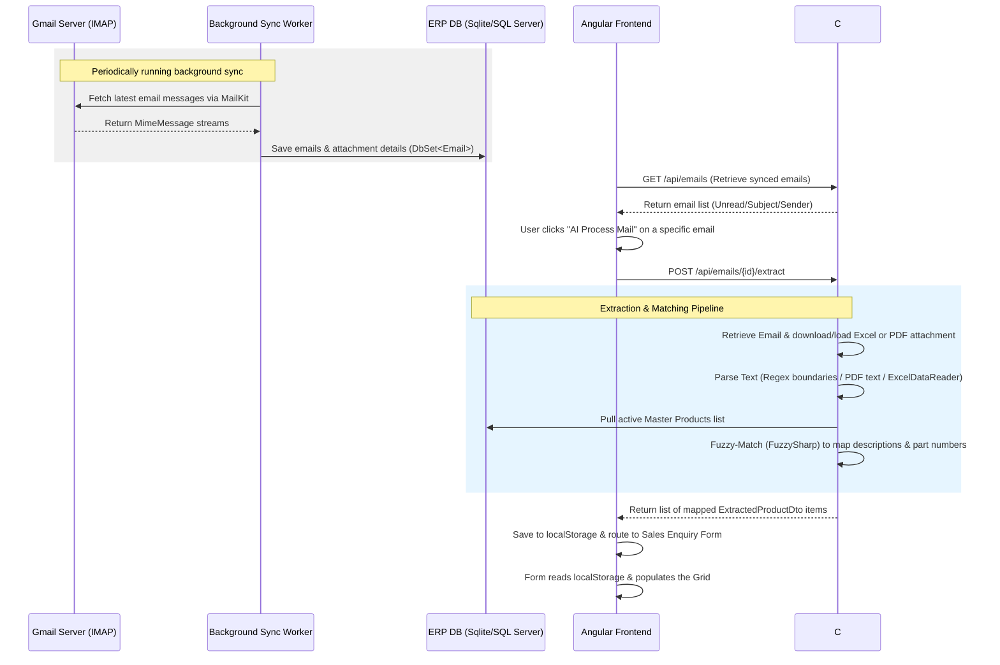

# Feature Replication Guide: Email Sync, Product Extraction & Grid Display

This guide details how to migrate the email syncing, PDF/Excel product extraction, and auto-populating grid features from the prototype to the main ERP codebase. 

---

## 👨‍💻 How to Present This to Your Senior Developer

When discussing this migration with your senior developer, frame it around the **business value**, the **architectural clean-separation**, and the **low integration footprint**. Here is a suggested template/talking-points guide:

### Talking Points & Value Proposition
* **Automation Value:** "We automated the manual entry of sales enquiries. The system regularly syncs incoming emails from Gmail, extracts line items from the email body or attachments (Excel/PDF), fuzzy-matches them against our product catalog, and populates the grid for immediate review, saving sales reps up to 90% of the data-entry time."
* **Reliability & Performance:** "The IMAP syncing uses index-based fetching (pulling only the last 20 messages) rather than scanning the entire inbox, which ensures high performance. The extraction endpoints have strict cancellation timeouts (15–20s) so the backend never blocks."
* **High Modularity:** "The backend functionality is divided into independent service classes (for email syncing, text extraction, Excel parsing, PDF parsing, and fuzzy matching). This keeps the database models and controller code extremely clean and simple to integrate."

---

## 🛠️ Backend Blueprint (.NET 9 Web API)

To replicate this feature in the main project, copy or recreate the following files in the corresponding backend folders:

### 1. Controllers & Models

* #### [EmailsController.cs](file:///d:/AriyAI/chatbot_/backend/AriyAI.ERP.Api/Controllers/EmailsController.cs)
  * **Role:** Exposes API endpoints for listing emails (`GET`), syncing Gmail (`POST`), extracting product data (`POST`), and sending an email acknowledgement with a summary attachment (`POST`).
  * **How to migrate:** Copy the controller class. Update the namespace to match the main project. Ensure your main Dependency Injection setup registers the required services (SyncWorker, ExtractionService, MatchingService).

* #### [Email.cs](file:///d:/AriyAI/chatbot_/backend/AriyAI.ERP.Api/Models/Email.cs)
  * **Role:** Stores email metadata (Sender, Recipient, Subject, Body, Attachments JSON array, IsRead, IsDeleted).
  * **How to migrate:** Add this model to your EF Core models. Include it in the `DbContext` class as a `DbSet<Email>` and run a DB migration.

### 2. Extraction & Parsing Services

* #### [EmailSyncWorker.cs](file:///d:/AriyAI/chatbot_/backend/AriyAI.ERP.Api/Services/EmailSyncWorker.cs)
  * **Role:** A background service (`BackgroundService`) that periodically (every 2 minutes) syncs the Gmail Inbox via IMAP.
  * **How to migrate:** Register it as a hosted service in the main project's startup configuration (`Program.cs` / `Startup.cs`).
  * **Environment Variables needed:** `EMAIL_USER`, `EMAIL_PASSWORD`, `IMAP_SERVER`, `IMAP_PORT`.

* #### [ExtractionService.cs](file:///d:/AriyAI/chatbot_/backend/AriyAI.ERP.Api/Services/ExtractionService.cs)
  * **Role:** Contains regex boundaries to isolate product lines from unstructured email bodies or extracted PDF texts.
  * **How to migrate:** Copy to your services layer. Register it in Program.cs.

* #### [ExcelParsingService.cs](file:///d:/AriyAI/chatbot_/backend/AriyAI.ERP.Api/Services/ExcelParsingService.cs)
  * **Role:** Uses `ExcelDataReader` to dynamically locate key columns (Description, Part Number, Qty, Make, Model) and parse tabular product details from Excel attachments.
  * **How to migrate:** Copy to your services layer. Ensure CodePages encoding is registered (`System.Text.Encoding.RegisterProvider(System.Text.CodePagesEncodingProvider.Instance);`).

* #### [PdfParsingService.cs](file:///d:/AriyAI/chatbot_/backend/AriyAI.ERP.Api/Services/PdfParsingService.cs)
  * **Role:** Extracts plain layout-aware text from PDF attachments using `PdfPig`.
  * **How to migrate:** Copy to your services folder.

* #### [MatchingService.cs](file:///d:/AriyAI/chatbot_/backend/AriyAI.ERP.Api/Services/MatchingService.cs)
  * **Role:** Fuzzy-matches extracted line items against the database's master product catalog (`Products` table) using `FuzzySharp`.
  * **How to migrate:** Copy to your services. It needs to read your database context (`DbContext`) to pull the active product list for matching.

### 3. Dependencies
Add these Package References to your main backend project file (like [AriyAI.ERP.Api.csproj](file:///d:/AriyAI/chatbot_/backend/AriyAI.ERP.Api/AriyAI.ERP.Api.csproj)):
```xml
<PackageReference Include="ExcelDataReader" Version="3.9.0" />
<PackageReference Include="ExcelDataReader.DataSet" Version="3.9.0" />
<PackageReference Include="MailKit" Version="4.10.0" />
<PackageReference Include="FuzzySharp" Version="2.0.2" />
<PackageReference Include="PdfPig" Version="0.1.9" />
```

---

## 🎨 Frontend Blueprint (Angular Component & Routing)

The frontend uses `localStorage` and a lightweight window-based event listener to safely bridge data from the header/notification area over to the form module.

### 1. Ingestion & Trigger Area
* #### [header.component.ts](file:///d:/AriyAI/chatbot_/frontend/src/app/layout/header/header.component.ts)
  * **Role:** Handles email polling, displaying the unread notification dot, rendering the side-panel email detail viewer, and calling the AI parsing endpoint.
  * **Key Logic to Copy:**
    1. The `aiProcessMail()` method:
       * Posts to the backend extraction endpoint: `POST /api/emails/{id}/extract`.
       * Saves the returned JSON array to `localStorage.setItem('extractedEmailProducts', JSON.stringify(extractedItems))`.
       * Navigates to `/lead/sales-enquiry/new`.
       * Fires a custom window event: `window.dispatchEvent(new Event('extractedEmailProductsLoaded'))`.

### 2. Auto-Populating Grid Receiver
* #### [enquiry-form.component.ts](file:///d:/AriyAI/chatbot_/frontend/src/app/modules/sales-enquiry/enquiry-form/enquiry-form.component.ts)
  * **Role:** Recipient page that populates its lines of products using the parsed items.
  * **Key Logic to Copy:**
    1. Listen to the custom event via `@HostListener('window:extractedEmailProductsLoaded')`.
    2. Retrieve items from local storage: `localStorage.getItem('extractedEmailProducts')`.
    3. Update the data model binding: `this.enquiry.enquiryProducts = JSON.parse(data)`.
    4. Automatically direct the active tab index to `'products'` so the user instantly sees the grid.
    5. Clean up the storage key (`localStorage.removeItem`).

* #### [enquiry-form.component.html](file:///d:/AriyAI/chatbot_/frontend/src/app/modules/sales-enquiry/enquiry-form/enquiry-form.component.html)
  * **Role:** Renders the table grid for product line items.
  * **Key HTML to Copy:**
    * The table body row loops through the model:
      ```html
      <tr *ngFor="let item of enquiry.enquiryProducts; let idx = index">
        <td>{{ idx + 1 }}</td>
        <td>{{ item.group }}</td>
        <td>{{ item.productDescription }}</td>
        <td>{{ item.partNumber || '—' }}</td>
        <td>{{ item.make || '—' }}</td>
        <td>{{ item.model || '—' }}</td>
        <td>{{ item.quantity }}</td>
        <td>{{ item.rate | number:'1.2-2' }}</td>
        <td>
          <span class="badge" [class.badge-approved]="item.mapping === 'Mapped' || item.mapping === 'Matched'" [class.badge-rejected]="item.mapping === 'Unmapped'">
            {{ item.mapping || 'Mapped' }}
          </span>
        </td>
      </tr>
      ```

---

## 🔄 End-to-End Data Flow Diagram



> [!TIP]
> **Recommended Transition Strategy:** Replicate the service classes `ExcelParsingService`, `PdfParsingService`, `ExtractionService`, and `MatchingService` first, and build a quick Console application or unit tests in the main backend project to test attachment parsing. This ensures the parsing engine is 100% stable before connecting it to the IMAP sync worker and frontend views.
